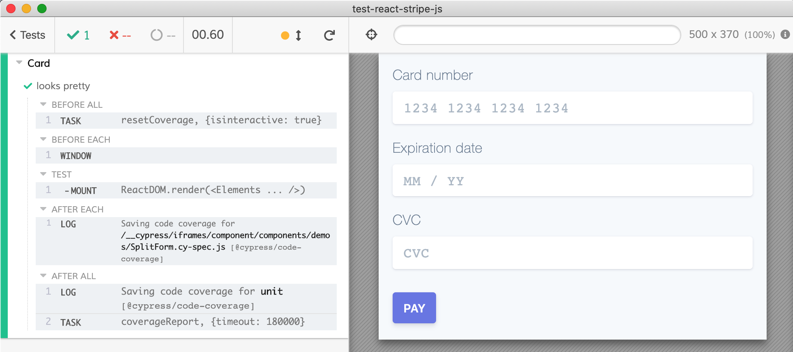

# Stripe React Demo

Copied from [https://codesandbox.io/s/react-stripe-official-q1loc](https://codesandbox.io/s/react-stripe-official-q1loc) from [https://github.com/stripe/react-stripe-js](https://github.com/stripe/react-stripe-js)

Uses [cypress-react-unit-test v2](https://github.com/bahmutov/cypress-react-unit-test/pull/108)

TODO:
- add iframe commands to reach into the Stripe's iframe to type the CC number
- figure out why I cannot spy or stub `stripe.createPaymentMethod` method. Seems there is a weird getter that does not allow setting new method property
